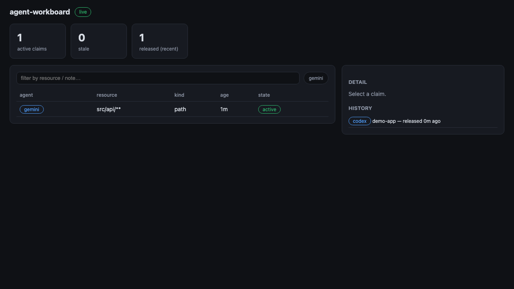

# agent-workboard

[](https://github.com/oh-namgyu/agent-workboard/actions/workflows/ci.yml)
[](LICENSE)
[](https://github.com/oh-namgyu/agent-workboard/releases)


> **한글 요약** — 여러 AI 코딩 에이전트(Claude Code·Codex·Gemini)가 같은 코드베이스에서 서로 충돌하지 않도록 하는 자원 claim 보드입니다. REST 서버 + 실시간 대시보드 + CLI + 훅 기반 강제 키트로 구성됩니다. *(전체 한국어 문서: [README_KOR.md](README_KOR.md))*

**[🇰🇷 한국어 README](README_KOR.md)**

A claim board that keeps multiple AI coding agents — Claude Code, Codex CLI, Gemini CLI, or
any tool that can run a shell command — from clobbering each other in the same codebase.

Agents **claim** a project (or a path glob) before editing, **release** it when done, and a
live dashboard shows who is working where. For Claude Code, an included `PreToolUse` hook
turns the convention into enforcement: edits to a resource claimed by another agent are
**blocked with the holder's name** before they happen.



## Why

Running two or three coding agents on one machine is normal now. Running them in the same
repository is how you get silently overwritten files, dirty-tree races, and "where did my
change go". File locks don't help — agents hold no file handles between turns. What works is
a session-level protocol: *check in before you edit, check out when you leave* — with a board
everyone can see, a TTL reaper for crashed sessions, and hooks that enforce it where possible.

## Quick start

```bash
git clone https://github.com/oh-namgyu/agent-workboard && cd agent-workboard
npm install

# 1. start the board (loopback only, port 5054)
npx . serve

# 2. open the dashboard
open http://127.0.0.1:5054

# 3. wire up Claude Code in any project (hooks + /claim /release /board commands)
cd ~/code/my-app && node /path/to/agent-workboard/src/cli.js install-claude
```

From then on, every Claude Code session in `my-app` claims the project on start, releases on
end, and refuses to edit anything actively claimed by another agent.

## How it works

```
Claude Code ── PreToolUse hook ──┐                       ┌─ SQLite (~/.agent-workboard/)
Codex CLI ──── AGENTS.md rules ──┼──> workboard CLI ──> REST server :5054
Gemini CLI ─── GEMINI.md rules ──┘                       ├─ TTL reaper (stale claims)
You ────────── dashboard (force release, live view) <────┘
```

**Conflict rules** — a claim blocks another agent when:

| Your action | Blocked by |
|---|---|
| claim/edit in project `my-app` | another agent's active claim on `my-app` |
| edit `src/api/users.js` | another agent's `path` claim whose glob matches (e.g. `src/api/**`) |

Same-agent re-claims are idempotent (they refresh the heartbeat). Claims with no heartbeat
for the TTL (default 30 min) are flagged **stale**; after 2× TTL the reaper auto-releases them.

## CLI

```
workboard serve [--port N] [--host H] [--db FILE] [--ttl MINUTES]
workboard claim <resource> [--agent NAME] [--note TEXT] [--kind project|path]
workboard release <resource> [--agent NAME] | --id ID
workboard list [--json]
workboard check [--resource R] [--path FILE] [--agent NAME]    # exit 2 = blocked
workboard watch [--interval SECONDS]
workboard install-claude [--project DIR]
```

With no `<resource>`, `claim`/`release`/`check` use the current directory name — run them
from the project root. Identity comes from `--agent` or `WORKBOARD_AGENT`.

## REST API

| Method | Path | Description |
|---|---|---|
| GET | `/api/claims` | active claims (with `stale` flags) + recent history |
| POST | `/api/claims` | `{agent, resource, kind?, note?}` → 201, or **409 + conflicts** |
| POST | `/api/claims/:id/heartbeat` | keep a long-running claim fresh |
| POST | `/api/claims/:id/release` | `{by?}` → release |
| GET | `/api/check?agent=&resource=&path=` | conflict probe → `{allowed, conflicts}` |
| GET | `/api/events` | SSE stream (`update` on every change) |

## Agent integrations

- **Claude Code** — `workboard install-claude` writes into the project's
  `.claude/settings.local.json` and `.claude/commands/` (idempotent):
  - `PreToolUse` (Edit/Write/MultiEdit/NotebookEdit): blocks edits on conflicting claims, exit 2
    with the holder's name so the agent coordinates instead of retrying
  - `SessionStart` / `SessionEnd`: automatic check-in / check-out
  - `/claim`, `/release`, `/board` slash commands
- **Codex CLI** — copy [integrations/AGENTS-snippet.md](integrations/AGENTS-snippet.md) into your `AGENTS.md`
- **Gemini CLI** — copy [integrations/GEMINI-snippet.md](integrations/GEMINI-snippet.md) into your `GEMINI.md`
- **Anything else** — it's a CLI and a REST API; if your agent can run a shell command, it can participate

Hooks **fail open**: a down board never bricks an agent session. See
[docs/PATTERNS.md](docs/PATTERNS.md) for claim granularity, TTL tuning, and human-override patterns.

## Configuration

| Env | Default | |
|---|---|---|
| `WORKBOARD_PORT` | `5054` | server port |
| `WORKBOARD_HOST` | `127.0.0.1` | bind address (see [SECURITY.md](SECURITY.md) before widening) |
| `WORKBOARD_DB` | `~/.agent-workboard/workboard.db` | SQLite file |
| `WORKBOARD_TTL_MIN` | `30` | minutes until a claim is stale (auto-release at 2×) |
| `WORKBOARD_URL` | `http://127.0.0.1:5054` | server URL used by CLI/hooks |
| `WORKBOARD_AGENT` | `agent` (`claude` in hooks) | agent identity |

## Docker

```bash
docker compose up -d   # board on 127.0.0.1:5054, db persisted in a volume
```

## Development

```bash
npm test   # unit + HTTP lifecycle + CLI e2e (two simulated agents colliding)
```

MIT — see [LICENSE](LICENSE). Security model and reporting: [SECURITY.md](SECURITY.md).
